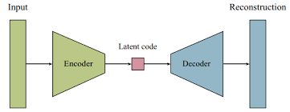
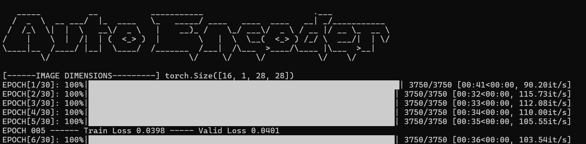
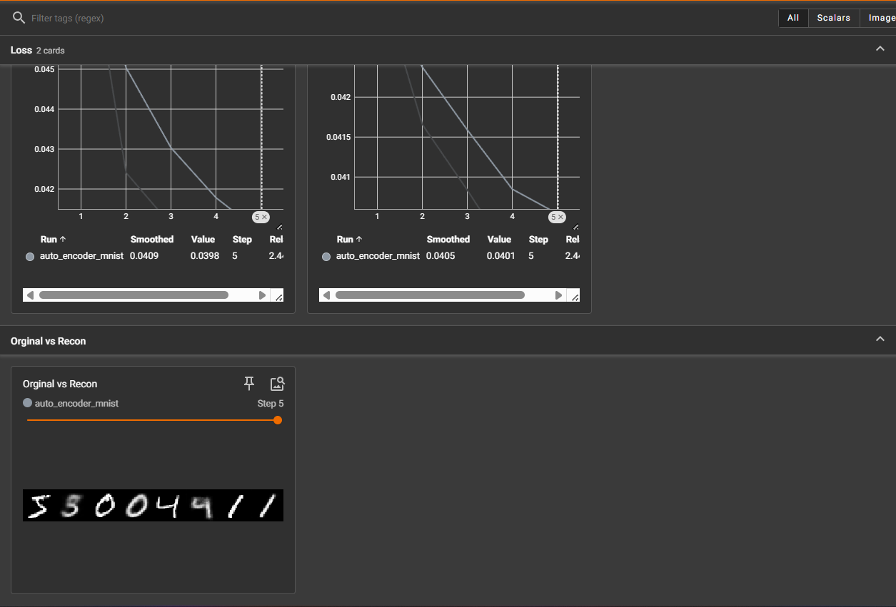

Architecture and Results

  

  

  

About Autoencoders
Autoencoders are unsupervised neural networks that learn to copy their inputs to outputs. They compress data into a latent representation and reconstruct it. This implementation uses MSE loss for reconstruction accuracy and L1 regularization to encourage sparse latent representations, preventing overfitting.

Loss Functions
MSE Loss: Measures pixel-wise reconstruction error between input and output images

L1 Regularization: Encourages sparsity in the latent representation to prevent overfitting

Results
The model successfully learns to reconstruct MNIST digit images with minimal loss, demonstrating effective feature learning in the latent space representation.